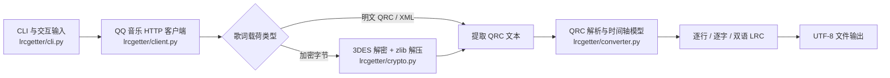

# LRCGetter 核心实现说明

本文档描述 LRCGetter 当前版本的内部实现，面向需要理解、调试或继续维护代码的
开发者。用户安装和操作方式仍以项目根目录的 `README.md` 为准。

## 1. 实现目标

LRCGetter 完成的是一条从 QQ 音乐曲库到本地 LRC 文件的转换链路：

1. 按歌曲名和歌手搜索曲库，或者直接使用 QQ 音乐歌曲 ID。
2. 调用 QQ 音乐 PC 客户端使用的歌词接口。
3. 识别明文、XML 包装或加密的歌词载荷。
4. 对加密 QRC 执行 3DES 解密和 zlib 解压。
5. 解析逐行、逐字、翻译和罗马音时间轴。
6. 生成通用 LRC 文件并保存搜索结果。

项目不依赖 QQ 音乐客户端、Windows DLL、Wine 或虚拟机。平台相关部分只负责
创建 Python 虚拟环境和启动程序，歌词处理逻辑全部位于 Python 包
`lrcgetter` 中。

## 2. 总体架构



各模块职责如下：

| 模块 | 主要职责 |
| --- | --- |
| `lrcgetter/cli.py` | 参数解析、交互循环、模式选择、业务流程编排、输出目录组织 |
| `lrcgetter/client.py` | QQ 音乐搜索和歌词下载、XML 响应解析、网络异常归一化 |
| `lrcgetter/crypto.py` | 加密 QRC 的 3DES 解密、zlib/gzip 兼容解压 |
| `lrcgetter/converter.py` | QRC/LRC 文本识别、时间轴解析、格式转换和文件写入 |
| `install.*` / `run.*` | Windows、macOS 的虚拟环境安装和双击启动入口 |

`pyproject.toml` 将跨平台命令 `lrcgetter` 注册到
`lrcgetter.cli:main`。

## 3. 程序入口与运行模式

### 3.1 启动初始化

`main()` 首先调用 `configure_console_encoding()`，把标准输出和标准错误调整为
UTF-8。这样即使 Windows 当前代码页不能直接表示中文，帮助信息和交互提示也
不会因为编码错误而中断。

随后 `build_parser()` 解析以下核心参数：

| 参数 | 含义 |
| --- | --- |
| `title` | 可选歌曲名；提供后进入单次搜索模式 |
| `-a` / `--artist` | 可选歌手名，用于缩小搜索范围 |
| `--song-id` | 跳过搜索，直接按正整数歌曲 ID 下载 |
| `-o` / `--output` | 输出根目录，默认是当前工作目录下的 `lyric` |
| `--timeout` | 单次 HTTP 请求超时，默认 20 秒 |

歌曲名和 `--song-id` 互斥。歌曲 ID 必须是只包含 ASCII 数字的正整数，避免把
空值、负数、全角数字等输入发送到接口。

### 3.2 三种业务路径

程序根据参数进入三种路径：

1. **歌曲 ID 模式**：调用 `download_by_id()`，不进行搜索。
2. **歌曲名模式**：调用一次 `download_one()`，成功返回 0，无结果或取消返回
   1。
3. **交互模式**：循环读取歌曲名或纯数字 ID，单次失败不会退出整个程序。

交互模式遇到纯数字时会先询问它是歌曲 ID 还是歌曲名。代码还保留
`id:123` 形式作为兼容输入，但界面不会主动提示该写法。

## 4. QQ 音乐 HTTP 客户端

核心类型是 `QQMusicClient`。它内部使用一个可替换的 `requests.Session`，
默认设置浏览器 User-Agent 和 `https://y.qq.com/` Referer。可替换 Session
也让单元测试能够在不访问网络的情况下验证请求参数。

所有 GET 请求都经过 `_get()`：

- 使用实例级 `timeout`。
- 调用 `raise_for_status()` 检查 HTTP 状态。
- 将 `requests.RequestException` 统一转换为 `QQMusicError`。

### 4.1 歌曲搜索

`search(title, artist, limit)` 请求：

```text
https://c.y.qq.com/lyric/fcgi-bin/fcg_search_pc_lrc.fcg
```

主要查询参数为：

```text
SONGNAME=<歌曲名>
SINGERNAME=<歌手名>
TYPE=2
RANGE_MIN=1
RANGE_MAX=<1 到 50>
```

响应按 XML 解析。`<result>` 非 `0` 时，接口返回被视为拒绝，并尽量从
`<reason>` 提取原因。每个 `<songinfo>` 被转换为不可变的 `Song`：

```python
Song(
    song_id="323823965",
    title="歌曲名",
    artist="歌手名",
    album="专辑名",
)
```

名称字段经过 URL 解码。生成器严格保持接口中 `<songinfo>` 的原始顺序，不在
本地按歌曲 ID、时间或名称排序。界面中“较大 ID 往往录入较晚”的说明只是选择
提示，不参与算法。

### 4.2 歌词下载

`download(song_id)` 请求：

```text
https://c.y.qq.com/qqmusic/fcgi-bin/lyric_download.fcg
```

固定参数包含 `version=15`、`miniversion=82`、`lrctype=4`，并通过
`musicid` 传入歌曲 ID。

接口响应有时被包在 XML 注释中，因此解析前会去掉 `<!--` 和 `-->`。三个字段
映射为：

| 内部键 | XML 标签 | 内容 |
| --- | --- | --- |
| `orig` | `content` | 原文歌词 |
| `ts` | `contentts` | 中文翻译 |
| `roma` | `contentroma` | 罗马音 |

字段为空时保存为空字节。非空字段如果是偶数长度且全部为十六进制字符，就先
执行十六进制解码；否则按 UTF-8 明文字节处理。三个字段全部为空时抛出
`QQMusicError`，不会生成一个看似成功但没有内容的目录。

## 5. 歌词载荷识别与解密

`cli.decode_payloads()` 对 `orig`、`ts`、`roma` 分别判断：

1. 空字节直接转换为空字符串。
2. 去除左侧空白后以 `[` 或 `<?xml` 开头，按明文处理。
3. 其他内容视为加密 QRC，交给 `decrypt_qrc()`。

### 5.1 3DES 解密

QQ 音乐 QRC 使用三密钥 Triple DES ECB。`crypto.py` 使用固定密钥：

```text
!@#)(*$%123ZXC!@!@#)(NHL
```

底层由 `pyqqmusicdes.decrypt_des()` 完成与 QQ 音乐客户端兼容的字节级解密。
该扩展会原地修改 Python 字节缓冲区，所以 `decrypt_blocks()` 会先创建私有
副本，避免修改调用方持有的数据。

加密数据必须按 DES 的 8 字节块对齐。长度不满足要求，或底层解密状态非 0，
都会抛出 `QRCDecodeError`。

### 5.2 解压

3DES 输出是压缩数据。`decrypt_qrc()` 使用：

```python
zlib.decompress(compressed, zlib.MAX_WBITS | 32)
```

该模式兼容带 zlib 头和 gzip 头的载荷。解密或解压失败统一转换为
`QRCDecodeError`，上层无需了解底层库的异常类型。

## 6. QRC 文本提取与格式兼容

`extract_qrc_text()` 接受解密后的 UTF-8 字节，并处理三类输入。

### 6.1 原生 QRC 文本

只要非 XML 文本中至少存在一行符合：

```text
[开始毫秒,持续毫秒]歌词内容
```

就直接作为 QRC 返回。

### 6.2 XML 包装的 QRC

QQ 音乐可能把 QRC 放在：

```xml
<Lyric_1 LyricContent="..." />
```

XML 解析器会规范化属性中的换行，所以实现优先用正则读取原始
`LyricContent` 属性，再执行 HTML 实体反转义。只有正则未匹配时才使用
`xml.etree.ElementTree` 作为回退。

### 6.3 普通逐行 LRC

如果文本既不是 XML，也没有 QRC 行，就调用 `lrc_to_qrc()` 尝试兼容普通 LRC：

- 保留 `[ti:...]`、`[ar:...]` 等元数据。
- 把 `[mm:ss.xx]内容` 转换为毫秒起点。
- 当前行持续时间取“下一行起点 - 当前行起点”。
- 最后一行默认持续 5000 毫秒。
- 无法识别的行会被忽略。

这一回退能生成逐行 LRC，但普通 LRC 本身没有逐字时间，因此不会凭空生成
逐字 token。

## 7. QRC 时间轴模型

`parse_qrc()` 把文本解析成：

```python
TimedLine(
    start=1000,
    duration=1000,
    text="你好",
    tokens=(
        ("你", 1000, 500),
        ("好", 1500, 500),
    ),
)
```

行级语法：

```text
[1000,1000]你(1000,500)好(1500,500)
```

其中：

- 行头的两个数字是行开始毫秒和持续毫秒。
- 每个 token 后的两个数字是 token 开始毫秒和持续毫秒。
- `text` 是移除 token 时间标记后的纯文本。
- 不符合时间轴语法的非空行进入 `ignored`，通常是歌曲元数据。

时间在输出前由 `format_time()` 四舍五入到 10 毫秒，格式为
`mm:ss.xx`，并把负值限制为 0。

## 8. LRC 生成策略

### 8.1 逐行 LRC

`line_lrc()` 只使用行开始时间：

```text
[00:01.00]你好
```

原文、翻译和罗马音都可以生成逐行文件。

### 8.2 逐字 LRC

`char_lrc()` 在每个 token 前写入其开始时间，并在行尾补上整行结束时间：

```text
[00:01.00]你[00:01.50]好[00:02.00]
```

只有带 token 时间轴的原文和罗马音会生成逐字文件。没有 token 的行会跳过，
翻译歌词也不生成伪造的逐字时间。

### 8.3 原文逐字与翻译双语 LRC

`bilingual_lrc()` 先按完全相同的行开始毫秒匹配翻译。如果没有匹配项，则回退
到原文和翻译列表中的相同序号。

每组内容按以下顺序写出：

1. 原文逐字时间轴；原文没有 token 时使用逐行时间。
2. 翻译文本，时间放在原文行结束前 20 毫秒；持续时间不足 20 毫秒时不早于
   原文行开始时间。

这让支持逐字 LRC 的播放器先展示原文时间轴，再在接近本行结束的位置接入
译文，同时避免译文时间早于原文。

## 9. 文件和目录组织

`save_song_outputs()` 使用以下目录结构：

```text
<输出根目录>/
└── <歌曲名>-<歌手名>/
    ├── <歌曲名>-idlist.txt
    └── <歌曲ID>-<Unix时间戳>/
        ├── <歌曲名>-og-line.lrc
        ├── <歌曲名>-og-char.lrc
        ├── <歌曲名>-ch-line.lrc
        ├── <歌曲名>-rm-line.lrc
        ├── <歌曲名>-rm-char.lrc
        ├── <歌曲名>-og&ch-mix.lrc
        └── <歌曲名>-*-ignr.txt
```

只有内容非空的文件才会创建。`*-ignr.txt` 保存对应歌词中没有进入时间轴的
非空行，例如标题、歌手和 offset 元数据。

歌曲名、歌手和文件名在写入前经过 `safe_component()`：

- 控制字符和 Windows/macOS 不安全字符替换为全角下划线 `＿`。
- 去掉首尾空格和句点。
- 清理后为空时使用 `unknown`。

时间戳目录可以避免多次下载同一歌曲时覆盖已有 LRC。搜索模式还会在歌曲目录
写入 `<歌曲名>-idlist.txt`，记录本次接口返回的全部候选项和顺序。直接歌曲
ID 模式没有搜索结果，因此不创建该文件。

### 9.1 直接 ID 模式的标题和歌手

直接 ID 模式没有搜索阶段，标题和歌手来自歌词中的 `[ti:...]` 与 `[ar:...]`
元数据。合并优先级依次为原文、翻译、罗马音，已经取得的字段不会被后续类型
覆盖。

如果歌词没有标题，使用 `QQMusic-<歌曲ID>`；没有歌手时，目录中的歌手部分会
经 `safe_component()` 变为 `unknown`。

## 10. 异常边界和退出码

项目定义两类主要业务异常：

| 异常 | 来源 |
| --- | --- |
| `QQMusicError` | 网络失败、接口拒绝、响应内容缺失或格式无效 |
| `QRCDecodeError` | DES 块不合法、底层解密失败、压缩流无法解压 |

另外，XML/QRC 内容解析可能产生 `ValueError`。CLI 会统一捕获以上异常并以
`失败：<原因>` 输出到标准错误。

不同运行方式的行为是：

- 单次歌曲名或 ID 模式失败时返回退出码 1。
- 交互模式单曲失败后继续等待下一次输入。
- `Ctrl+C` 返回 130。
- 正常完成或用户在交互模式直接回车退出时返回 0。

文件系统权限不足、磁盘写入失败等操作系统级异常当前不会被包装，会保留原始
堆栈和非零退出状态，便于定位环境问题。

## 11. 平台启动实现

### 11.1 Windows

`install.bat`：

- 优先使用 `py -3`，否则回退到 `python`。
- 创建 `.venv` 并确认 Python 不低于 3.10。
- 始终通过 `.venv\Scripts\python.exe -m pip` 安装，避免依赖全局 `pip`。

`run.bat`：

- 将代码页切到 UTF-8。
- 首次运行时调用 `install.bat`。
- 检查关键依赖，缺失时自动重装当前项目。
- 使用 `.venv\Scripts\python.exe -m lrcgetter.cli` 启动。
- 保留错误窗口和退出码，避免双击失败后一闪而过。

### 11.2 macOS

`install.command` 使用 `python3` 创建 `.venv` 并安装当前项目。
`run.command` 在虚拟环境不存在时执行首次安装，然后用
`.venv/bin/python -m lrcgetter.cli` 启动。

平台脚本只是便捷入口，不会分叉核心业务实现。

## 12. 依赖及其作用

| 依赖 | 用途 |
| --- | --- |
| `requests` | HTTP Session、超时、状态检查和网络异常 |
| `beautifulsoup4` | 搜索与下载响应的 XML 节点查询 |
| `lxml` | BeautifulSoup 的 XML 解析后端 |
| `pyqqmusicdes` | 与 QQ 音乐客户端字节兼容的 3DES 解密 |
| `pytest` | 开发和 CI 回归测试，仅属于 `test` 可选依赖 |

## 13. 测试与持续集成

测试分成四组：

- `tests/test_client.py`：请求参数、URL 解码、十六进制/明文响应、空响应。
- `tests/test_crypto.py`：使用固定向量验证 DES 解密结果。
- `tests/test_converter.py`：QRC 解析、各类 LRC、直接 ID、交互输入、默认目录和
  Windows 旧控制台编码。
- `tests/test_platform_support.py`：Windows 脚本、品牌命名、CI 平台矩阵。

GitHub Actions 对 Ubuntu、macOS、Windows 分别使用 Python 3.10 和 3.13，
执行安装、测试、命令入口检查和 wheel 构建。真实 QQ 音乐接口没有放入 CI，
避免网络波动、接口限流或第三方状态导致单元测试不稳定。

## 14. 已知边界与维护注意事项

1. QQ 音乐搜索和歌词下载地址是非公开接口，参数或响应格式可能由上游随时
   调整。
2. 搜索顺序完全来自接口；歌曲 ID 大小只是人工选择参考，不是可靠的新旧版本
   标记。
3. 直接 ID 模式依赖歌词内嵌元数据，曲库中的现场版、翻唱版或错误元数据会
   原样反映到目录名称。
4. 双语匹配优先依赖相同起始时间，回退到相同序号；原文和翻译严重错行时可能
   需要更复杂的相似度匹配。
5. 普通 LRC 回退只能恢复行级时间，不能恢复不存在的逐字时间。
6. 修改解密逻辑时必须保留 8 字节块校验、私有缓冲区副本和固定向量测试。
7. 新增输出格式应优先基于 `TimedLine`，不要在 CLI 层重复解析 QRC。

## 15. 主要函数调用关系

```text
main
├── download_by_id
│   ├── QQMusicClient.download
│   ├── decode_payloads
│   │   ├── decrypt_qrc
│   │   │   └── decrypt_blocks
│   │   └── extract_qrc_text
│   ├── extract_metadata
│   └── save_song_outputs
│       └── write_outputs
│           ├── parse_qrc
│           ├── line_lrc
│           ├── char_lrc
│           └── bilingual_lrc
└── download_one
    ├── QQMusicClient.search
    ├── choose_song
    ├── QQMusicClient.download
    ├── decode_payloads
    ├── save_song_outputs
    └── 写入 idlist.txt
```

这条调用关系也是排查问题时的建议顺序：先确认输入模式和歌曲 ID，再确认 HTTP
响应，其次检查解密与 QRC 文本，最后检查时间轴转换和文件写入。
